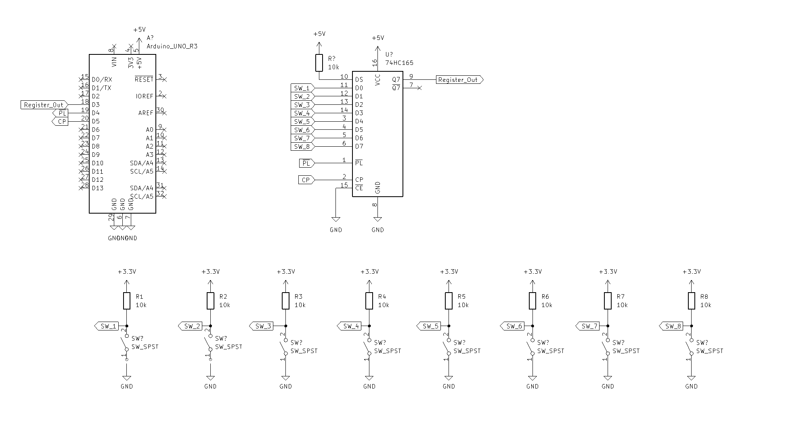
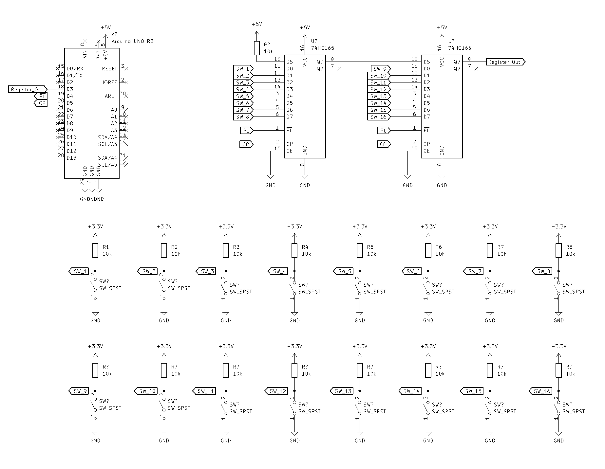

# 74HC165 Shift Register Switch Scanner for Arduino-ish environment
A Header-only switch scanner with configurable parameters. Commonly used with Kinoshita Laboratory's products.

## Features
- Do not use timer(like Bounce2 library cf. https://github.com/thomasfredericks/Bounce2)
- Parameters(pins, number of switches, delay time to debounce) are configurable via template parameters to reduce memory usage

## Requirements
This library assumes following Arduino standard functions working:
- pinMode() with INPUT_PULLUP
- millis()
- digitalRead()
- digitalOut()

Will works for the environment without arduino by porting functions above.

## Basic usage

### Use with single 74HC165
#### schematics:
Please note:
 - 74HC165's
     - #PL pin is connected to D4
     - CP pin is connected to D5
     - Register_Out is connected to D3
 - Number of Switches are 8



#### code (Arduino):
```cpp
#include "shiftregister_switchscanner.hpp"

// create instance for switch scanner
kinoshita_lab::ShiftregisterSwitchScanner<8, 4, D4, D5, D3> switch_scanner; // put num switches, bounce_delay, #PL, #CP, Q7(Register_Out) to template parameter

void switchChanged(const uint32_t switch_index, const int off_on)
{
  Serial.print("Button changed: index: ");
  Serial.print(switch_index);
  Serial.print(", state = ");
  Serial.println(off_on ? "ON" : "OFF");
}
void setup() 
{
  Serial.begin(115200); // for serial monitor

  // configure function to call on switch change
  switch_scanner.onChange(switchChanged);
}

void loop() 
{
  // execute scan
  switch_scanner.update();
}
```
### Use with cascaded 74HC165s
#### schematics:
Please note:
 - 74HC165s are cascaded with following connection:
     - #PL pin is connected to D4
     - CP pin is connected to D5
     - Register_Out is connected to D3
 - Number of Switches are 16



#### code (Arduino):

All you need to change is only the number of switches.

```cpp
#include "shiftregister_switchscanner.hpp"

// create instance for switch scanner
kinoshita_lab::ShiftregisterSwitchScanner<16, 4, D4, D5, D3> switch_scanner; // put num switches, bounce_delay, #PL, #CP, Q7(Register_Out) to template parameter

void switchChanged(const uint32_t switch_index, const int off_on)
{
  Serial.print("Button changed: index: ");
  Serial.print(switch_index);
  Serial.print(", state = ");
  Serial.println(off_on ? "ON" : "OFF");
}
void setup() 
{
  Serial.begin(115200); // for serial monitor

  // configure function to call on switch change
  switch_scanner.onChange(switchChanged);
}

void loop() 
{
  // execute scan
  switch_scanner.update();
}
```
